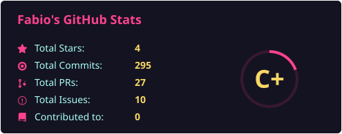

## 📊 GitHub Activity

  <table>
    <tr>
      <td align="center"><b>Public Stats Only (Vercel)</b></td>
      <td align="center"><b>Total Stats: Public + Private (Generated SVG)</b></td>
    </tr>
    <tr>
      <td></td>
      <td></td>
    </tr>
  </table>

---

## 📁 My Projects
Here is the list of projects I am working on:

### 🌐 Public Projects (Top 3 Recent)
- 🌐 [Filenametxt](https://github.com/Filenametxt/Filenametxt) — *Profile description repo* (2 commits)
- 🌐 [GymFly](https://github.com/Filenametxt/GymFly) — *Gestionale palestra: architettura a 4 livelli, PHP, Smarty e persistenza via Doctrine.* (179 commits)
- 🌐 [bank-ml-classifier](https://github.com/Filenametxt/bank-ml-classifier) — *The classification goal is to predict if the client will subscribe (yes/no) a term deposit (variable y).* (21 commits)

### 🔒 Private Projects (Top 3 Recent)
- 🔒 **BT_FabioAngelucci** (22 commits)
- 🔒 **sql_injection_test_php** (3 commits)
- 🔒 **Rust_on_MicroBlaze-Arty_template** (8 commits)

---

*This README updates automatically via GitHub Actions.*
